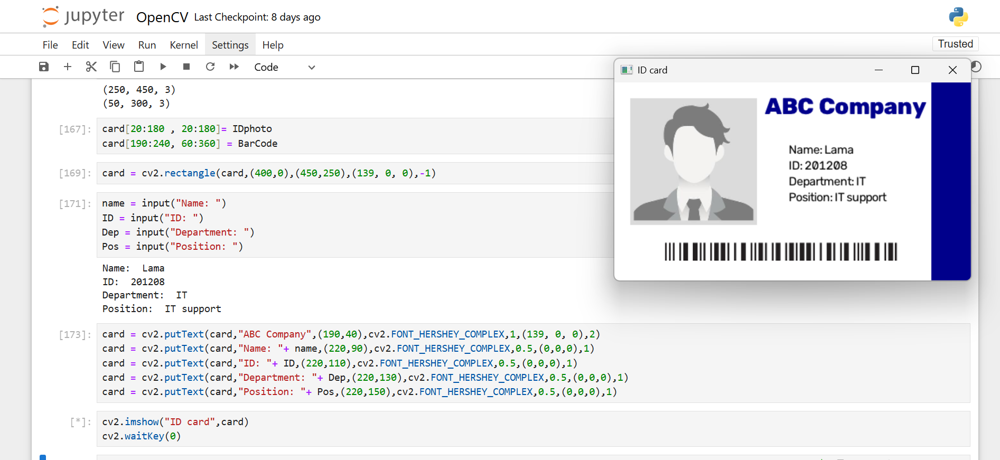

# ID Card Generator using OpenCV

A simple Python application that automatically generates a digital ID card using **OpenCV**. The program takes user information such as name, ID, department, position, and a personal photo, then places them onto a predefined ID card template to produce a complete, ready-to-use employee card.

## Demo

## Features

* Read and process images using OpenCV.
* Generate an ID card from a template.
* Insert user information dynamically.
* Resize and position the user's photo.
* Add formatted text to the card.
* Export the final ID card as an image.

## Technologies Used

* Python
* OpenCV
* NumPy

## What I Learned

Through this project, I gained hands-on experience with image processing fundamentals, including:

* Reading and displaying images.
* Resizing and positioning images.
* Working with image coordinates.
* Drawing text on images.
* Combining multiple image elements into a single output.
* Building a practical image processing application using OpenCV.
